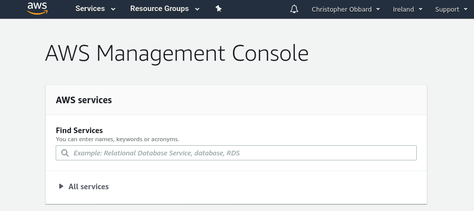
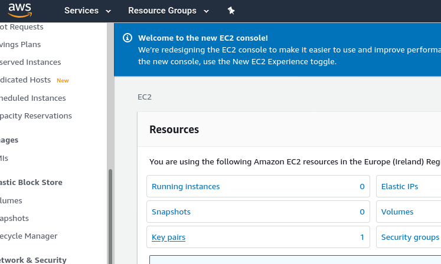
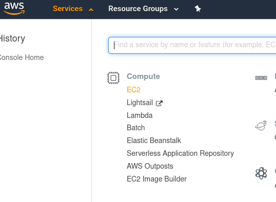
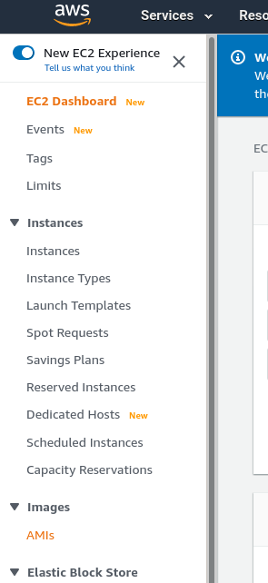
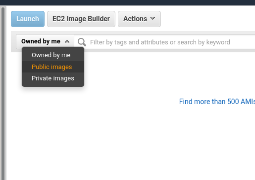
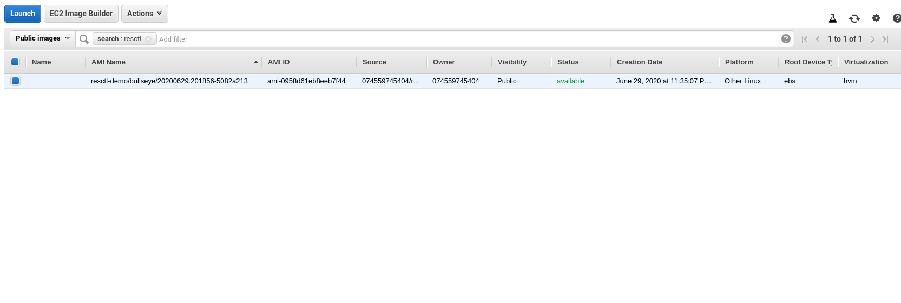
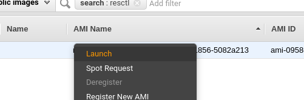
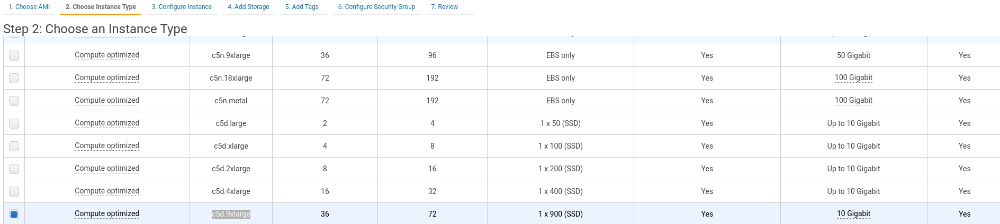
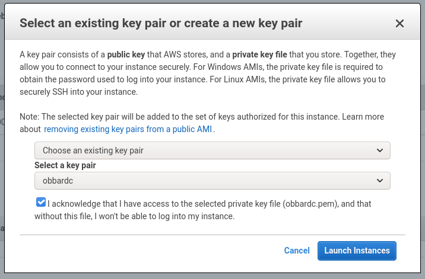
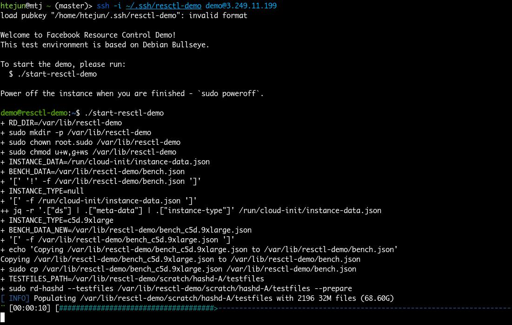

# Create AWS EC2 Instance for resctl-demo

## Login to AWS console

* Login to the AWS console: https://console.aws.amazon.com/console/home

* Make sure the region `Ireland` is selected in the menu bar.


---

* Make sure that your public key is setup in this region by navigating to `Services > EC2 > Key pairs` then choosing `Create key pair` and following the instructions. For more information see: https://docs.aws.amazon.com/AWSEC2/latest/UserGuide/ec2-key-pairs.html



## Find Amazon Machine Image (AMI)

### Select `Services > EC2` from the menu bar.

---

### Select `Images > AMIs` from the side bar.

---

### Select `Public images` from the search bar filter.

---

### Type `resctl-demo` into the search bar filter and press enter to see the list of available images.

* Make sure the owner is `920584875147`.
* The `AMI Name` is made up of the build timestamp, in the following format: `resctl-demo/<debian_codename>/YYYYMMDD.HHMMSS-<git_hash>`
* If there are multiple matching AMIs, pick the latest one.

---


## Launch AMI
### Right-click on the AMI you wish to launch and select `Launch`.

---

### Select instance type

* Select `c5d.9xlarge`, which is the only supported instance type.

* While the instance can be launched as-is, we want to configure a couple more things for convenience. Press the `Next` button.

---

### Configure Instance Details

* `Shutdown behavior > Terminate` removes the instance when it is shutdown.
* `User data` can be populated with cloud-init YAML data to add extra ssh keys, so that you can login with your usual ssh key in addition to the EC2 key-pair from above. For example:
```
#cloud-config
ssh_authorized_keys:
  - ssh-rsa AAAAB3NzaC1yc2EAAAADAQABAAABAQCjmeEPHu325dSeoEbMxI7d8ORK4aVKGvVD5kkrCctoIDEEugH3ajfM4Nble7KVDZu6PNq86ESSHta06rKR+Z9ujx7WvND5N5H7NPkWA2K5zCNKn9Pc62Q9apVAmCv8RaXo5T4V4mRhFn13fUNH46Wz0++2xDFi4X7+0PD7h1foJG8NAhUezJRa7rMLQmBfewE/Bmpz3bP3jg6xuw+t/ZDRGoHq1lwbkjSpPnFjsPKPxmKARfTzIiK7CT5UE0zkKju/fSGj3dUuvL6NluhjehcXwk/PjiXWUPHXA7YfdOJP6U8wQljP4mXOGWCNBK1HXNFCZ19F6J8s7QZVsfE0/hsb htejun
  - ssh-rsa AAAAB3NzaC1yc2EAAAABJQAAAQEAhPa8R9jgFJ2gv2bhCBMgEyniBsgyOtAQVm1NiycVEorpQSCBSlaqTy97k3Ro+lSgMuB5VwPZOZoUdawzUokTI+XCg7RZMi8GiTPfdAUr/AlsrVz4lTb3yoyGpIBVNvXAsf4gusHZSVhKQhJR2FfENfizkXSGOxLHbItl+I+GEtjgAdulba3S+Mx+ROhyDu8G6obf+wwqD3a3pg7w0vvReQt3wC0rMNS3voz8BW5OmZc2XZN5IWa9pVEDIKa1jAvE+QKXUAc6mOOGdjxT7+5Q/qV50QVtcEPcOmRJVW3yHhriEvy+OXA1eebUG62nmR+rY72we3Yjgyp20qz+3ILpEw== obbardc
```
* We're done configuring. Press the `Review and Launch` button.


### Review and Launch

* Check the information is correct and choose `Launch`.

### Choosing key pair

* Choose the key pair which was defined earlier and choose `Launch Instances`.

---

### Instance creation

* Once the instance is launched, click the `View Instances` button and then select the checkbox for the new instance.
---

### Login to instance

* After a few minutes, the `Instance State` should change to `running`. The resctl-demo image needs further initialization steps and will take several more minutes before accepting ssh connections.
* Do not attempt to connect to the machine using the `Connect` button, but instead login to the instance via SSH with the username `demo` and the public IP address in the instance info as shown below. Make sure your terminal is at least 160x50 and supports 256 colors. Login by running `ssh demo@IP_ADDR` where `IP_ADDR` is the public IP address. If you want to use the EC2 key-pair, you may need to specify the private key file explicitly - `ssh -i ec2_private_key_file`.

* It's ready. Run `./start-resctl-demo` and dive in!

---

### Instance system log
* If the instance fails to accept ssh connections, the console output may be useful for understanding what happened and reporting issues - right-click on the machine ID in the `Instances` view and choose `Instance settings > Get system log`. Note that AWS may take several minutes to populate the system log.