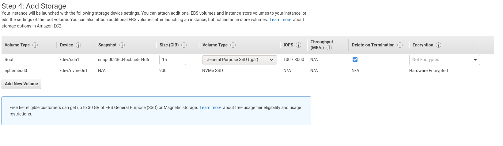
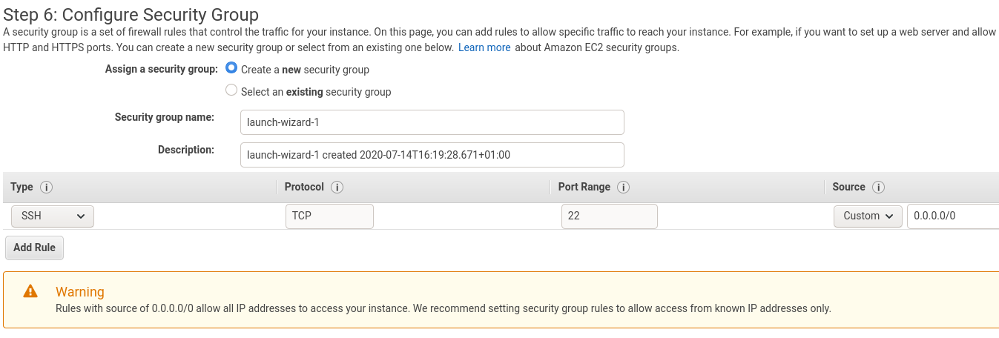
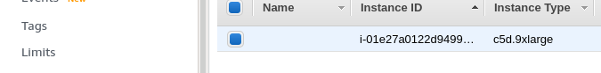

# Create AWS EC2 Instance for resctl-demo

## Login to AWS console
* Login to the AWS console: https://console.aws.amazon.com/console/home

* Make sure the region `Ireland` is selected in the menu bar.


---

* Make sure that your public key is setup in this region by navigating to `Services > EC2 > Key pairs` then choosing `Create key pair` and following the instructions. For more information see: https://docs.aws.amazon.com/AWSEC2/latest/UserGuide/ec2-key-pairs.html


## Find Amazon Machine Image (AMI)

### Select `Services > EC2` from the menu bar.

---

### Select `Images > AMIs` from the side bar.

---

### Select `Public images` from the search bar filter.

---

### Type `resctl` into the search bar filter and press enter to see the list of available images.

* Make sure the owner is `074559745404` (there is no filter for owner).
* The `AMI Name` is made up of the build timestamp, in the following format: `resctl-demo/<debian_codename>/YYYYMMDD.HHMMSS-<git_hash>`
* It is important to choose the right AMI here, there may be multiple to choose from.

---


## Launch AMI
### Right-click on the AMI you wish to launch and select `Launch`.

---

### `Next` Buttons

* Make sure to press the `Next` button and not `Review and Launch` through these screens.

---

### Select instance type

* For testing we have been using `c5d.9xlarge`.

---

### Configure Instance Details

* Mostly leave with the defaults, other than:
* `Shutdown behavior > Terminate` removes the machine when it is shutdown.
* `User data` can be populated with cloud-init YAML data to modify the machine once it has started.

For instance, to add keys of Tejun, Chris and Thomas to the instance:
```
#cloud-config
ssh_authorized_keys:
  # https://github.com/htejun.keys
  - ssh-rsa AAAAB3NzaC1yc2EAAAADAQABAAABAQCjmeEPHu325dSeoEbMxI7d8ORK4aVKGvVD5kkrCctoIDEEugH3ajfM4Nble7KVDZu6PNq86ESSHta06rKR+Z9ujx7WvND5N5H7NPkWA2K5zCNKn9Pc62Q9apVAmCv8RaXo5T4V4mRhFn13fUNH46Wz0++2xDFi4X7+0PD7h1foJG8NAhUezJRa7rMLQmBfewE/Bmpz3bP3jg6xuw+t/ZDRGoHq1lwbkjSpPnFjsPKPxmKARfTzIiK7CT5UE0zkKju/fSGj3dUuvL6NluhjehcXwk/PjiXWUPHXA7YfdOJP6U8wQljP4mXOGWCNBK1HXNFCZ19F6J8s7QZVsfE0/hsb htejun
  - ssh-rsa AAAAB3NzaC1yc2EAAAABJQAAAQEAhPa8R9jgFJ2gv2bhCBMgEyniBsgyOtAQVm1NiycVEorpQSCBSlaqTy97k3Ro+lSgMuB5VwPZOZoUdawzUokTI+XCg7RZMi8GiTPfdAUr/AlsrVz4lTb3yoyGpIBVNvXAsf4gusHZSVhKQhJR2FfENfizkXSGOxLHbItl+I+GEtjgAdulba3S+Mx+ROhyDu8G6obf+wwqD3a3pg7w0vvReQt3wC0rMNS3voz8BW5OmZc2XZN5IWa9pVEDIKa1jAvE+QKXUAc6mOOGdjxT7+5Q/qV50QVtcEPcOmRJVW3yHhriEvy+OXA1eebUG62nmR+rY72we3Yjgyp20qz+3ILpEw== obbardc
```

By default the public key uploaded to the key-pair section previously is included in the instance, adding User data allows you to add more keys if required.

---

### Add Storage
* Leave as defaults.

---

### Add Tags
* Leave as defaults.

### Configure Security Group
* Leave as defaults. This will only allow traffic in/out on port 22 from any host.
* Choose `Review and Launch`

---

### Review and Launch
* Check the information is correct and choose `Launch`.

### Choosing key pair
* Choose the key pair which was defined earlier and choose `Launch Instances`.

---

### Instance creation
* After a few seconds, you can click the machine ID to go to it in the instances log. There may be a slight delay with the system log review.

---

### Instance system log
* Right-click on the machine ID, choose `Instance settings > Get system log` to see the console output.
---

### Login to instance
* After a few minutes, the `Instance State` should change to `running` and the IP address should be present.
* Do not attempt to connect to the machine using the `Connect` button, but instead login to the instance via SSH with the username demo and the IP shown. Logging in can be done using the following command on your local machine (where `ip_address` is the instance IP address):
```
$ ssh demo@ip_address
```

---

